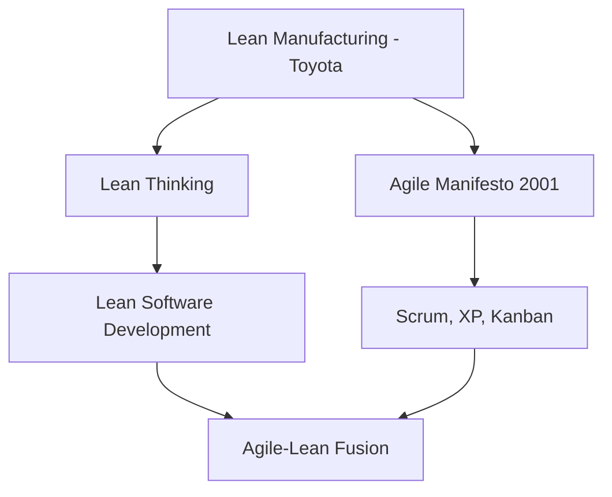

# Agile-Lean - Vista General

## ¿Qué es Agile-Lean?

Agile-Lean es la convergencia de dos marcos de trabajo que comparten raíces pero han evolucionado de forma diferente. Lean surge de Toyota en los años 50, mientras que Agile nace del Manifiesto Ágil en 2001, influenciado fuertemente por Lean.

Ambos buscan entregar valor al cliente de manera eficiente, pero lo hacen desde perspectivas complementarias.

## Orígenes compartidos

## Principios compartidos

### Flujo (Flow)
Tanto Lean como Agile priorizan el **flujo continuo de valor** sobre la optimización de recursos individuales. En Lean se habla de One-Piece-Flow; en Agile de iterative delivery.

### Pull System
Ambos sistemas operan bajo **pull**: solo se trabaja en lo que hay demanda real. Kanban es el ejemplo más claro de esta convergencia.

### Respeto por las personas
Lean enfatiza respeto por el trabajador y su conocimiento. Agile prioriza individuos e interacciones sobre procesos y herramientas. Ambos valoran la autonomía y el empoderamiento.

## Marcos clave en Agile-Lean

| Framework | Origen Lean | Enfoque |
|-----------|-------------|---------|
| **Scrum** | Iteraciones como PDCA | Timeboxed delivery |
| **Kanban** | Pull system directo | Flow optimization |
| **SAFe** | Value Stream thinking | Portfolio scaling |
| **XP** | Quality at source | Engineering practices |

## Diferencias sutiles

- **Lean** tiende a ser más **sistémico**: optimiza toda la cadena de valor
- **Agile** tiende a ser más **iterativo**: mejora mediante ciclos cortos
- **Lean** mide desperdicios (muda, mura, muri)
- **Agile** mide velocidad y capacidad del equipo

## Cuándo usar Agile-Lean

Cuando una organización necesita combinar la visión sistémica de Lean con la velocidad de ejecución de Agile. Especialmente útil en:

- Transformaciones digitales
- Equipos de desarrollo de software a escala
- Organizaciones que buscan agilidad y eficiencia simultáneamente

## Ver también

- [[../../02-Filosofia/01-que-es-lean]] - Fundamentos de Lean
- [[../../02-Filosofia/02-principios-lean]] - Los 5 principios de Lean
- [[06-lean-y-agile-diferencias]] - Comparativa detallada
