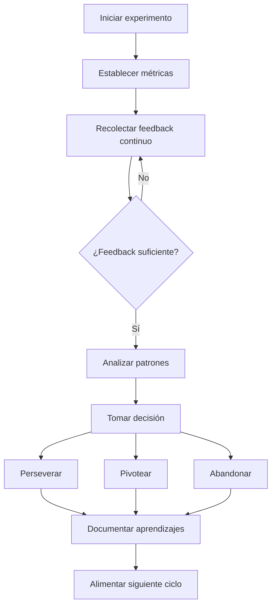

# Feedback Rápido

## ¿Qué es el Feedback Rápido?

El **feedback rápido** es la práctica de recolectar información de forma continua sobre el impacto de los cambios en las personas y la organización, en vez de esperar hasta el final de un proyecto para evaluar resultados. En Lean Change Management, el feedback es la base para ajustar planes y tomar decisiones informadas.

Como señala Jason Little en *Lean Change Management 2.0*:

> "Sólo cuando actúas y recibes feedback es cuando entiendes realmente el impacto de los cambios que tienes en tu mente."

El cambio es un proceso continuo y las realidades organizacionales están en constante evolución. Los enfoques tradicionales basados en planes rígidos no pueden capturar esta dinámica. El feedback rápido permite:

1. **Detectar problemas tempranamente** antes de que se conviertan en crisis.
2. **Ajustar el rumbo** con base en evidencia real, no en suposiciones.
3. **Aumentar la confianza** entre las personas y el equipo de cambio.
4. **Reducir la resistencia** al dar voz a las personas afectadas.

Ver también: [[01-experimentos-cambio]], [[02-canvas-cambio]]

---

## Fuentes de Feedback

Las fuentes de feedback en Lean Change Management se dividen en dos categorías principales:

### Prácticas (acciones tácticas)

| Práctica | Descripción | Cuándo usarla |
|----------|-------------|---------------|
| [[07-visual-management\|Radiadores de Información]] | Tableros visibles que muestran el progreso del cambio | Siempre — es la práctica más continua |
| Lean Coffee | Reuniones informales pero estructuradas | Inicio del cambio — para conocer perspectivas |
| Hackeo de Cultura | Intervenciones mínimas para exponer disfunciones | Cuando hay disfunciones que no se reconocen |
| Retrospectivas Ágiles | Reflexiones periódicas sobre qué funciona y qué no | Después de cada ciclo de experimentos |
| [[03-mapa-resistencia\|Análisis del Campo de Fuerzas]] | Mapeo de fuerzas a favor y en contra del cambio | Inicio o cuando hay bloqueos significativos |

### Evaluaciones (enfoques más formales)

| Evaluación | Descripción | Cuándo usarla |
|------------|-------------|---------------|
| ADKAR® | Evalúa五个condiciones individuales del cambio | Inicio de un gran cambio organizacional |
| IECO (OCAI) | Evalúa el tipo de cultura organizacional | Antes de diseñar estrategias de cambio |
| Modelo de Schneider | Identifica la cultura dominante | Para entender qué enfoques funcionarán mejor |
| Encuestas de percepción | Miden sentimientos y percepciones | Durante la implementación del cambio |

Ver también: [[04-entrevistas-estakeholders]]

---

## Práctica 1: Lean Coffee

Lean Coffee es una de las prácticas más poderosas para obtener feedback rápido. Fue utilizada extensamente en La Comisión para:

- Conectar con personas de diferentes departamentos.
- Identificar seguidores tempranos del cambio.
- Generar un diálogo honesto que reduce la resistencia.

### Cómo funciona

1. El facilitador crea un tablero Kanban con 3 columnas: *A discutir*, *En discusión*, *Discutido*.
2. Los participantes escriben preguntas o temas en notas autoadhesivas (5-10 minutos).
3. Se leen los temas en voz alta; se fusionan duplicados.
4. Cada persona vota con 2 puntos para priorizar.
5. Cada tema se discute 5 minutos; luego se vota si continuar 2 minutos más (👍 Sí, 👌 Neutral, 👎 No).

### Ejemplo de La Comisión

> "Aparecieron quince personas en la primera sesión de Lean Coffee. Fue una sorpresa agradable porque sólo había publicado carteles por el edificio; no había enviado invitaciones formales."

El Lean Coffee en La Comisión permitió:
- Identificar que el Deseo de cambio era alto entre los colaboradores.
- Descubrir un miembro de PMO que se convirtió en un aliado clave.
- Crear una Comunidad de Práctica de Analistas de Negocio.
- Generar un Lean Coffee para Directores que abrió diálogo entre niveles.

### Variante: Lean Coffee Ejecutivo

Para directores, se adapta la práctica:
- Seleccionar temas estratégicos en vez de operativos.
- Limitar el tiempo a 30 minutos.
- Incluir un paso de "acciones concretas" al final.

---

## Práctica 2: Retrospectivas Ágiles

Las retrospectivas son reuniones regulares donde el equipo reflexiona sobre qué funcionó, qué no, y qué cambiar. En Lean Change Management, se usan para obtener feedback tanto de los equipos como de los managers.

### Formato recomendado: Happy, Sad, Mad

1. Cada participante escribe en notas autoadhesivas las cosas que le hacen sentir *feliz*, *triste* o *enfadado*.
2. Se categorizan los resultados y se buscan patrones.
3. Se decide qué acción tomar para resolver los problemas identificados.

### Ejemplo de La Comisión: Comparar perspectivas

Jason Little facilitó retrospectivas separadas para equipos y managers usando el mismo formato:

> "Oculté los resultados de los colaboradores con papel de rotafolios, compartí la retrospectiva con los managers, y entonces hablamos de similitudes y diferencias. Algunos managers no tenían idea de cómo se estaban sintiendo sus colaboradores respecto a los cambios."

**Resultado**: Esta técnica reveló una brecha significativa entre la percepción de managers y colaboradores, generando hallazgos valiosos para orientar acciones correctivas.

### Beneficios clave

- Aumenta la transparencia y la comunicación.
- Crea un entendimiento mutuo entre niveles jerárquicos.
- Genera acción concreta basada en feedback real.
- Fortalece la confianza dentro de la organización.

---

## Práctica 3: Radiadores de Información como fuente de feedback

Los [[07-visual-management|radiadores de informacía]] no solo muestran progreso; también generan conversaciones que producen feedback.

### Ejemplo: La Puerta de los Hallazgos

En La Comisión, además de visualizar el progreso, crearon la **Puerta de los Hallazgos**:

> "Alentábamos a las personas a poner notas autoadhesivas con sus comentarios cuando necesitaban ayuda o tenían preocupaciones sobre los cambios que estábamos implementando."

**Características**:
- Feedback anónimo para reducir el riesgo de represalias.
- Visible para todos, generando transparencia.
- A veces no generaba acción inmediata, pero construía confianza.

> "Sentíamos que podríamos construir más confianza con las personas de la organización siendo totalmente transparentes, porque podrían ver que no escondíamos nada."

---

## Práctica 4: Hackeo de Cultura para feedback

El [[03-mapa-resistencia|hackeo de cultura]] es una práctica que genera feedback al provocar una respuesta de la organización.

### El ciclo: Crack → Hack → Zonas

1. **Crack**: Identificar una disfunción organizacional que genera tensión o frustración.
2. **Hack**: Diseñar una intervención mínima y astuta para exponer el Crack.
3. **Zonas de Hacking**: Evaluar el riesgo (Verde/Azul/Rojo) antes de ejecutar.

### Ejemplo de La Comisión

> "Mi Hack para el problema de la mudanza era configurar un tablero de feedback grande y visible a la entrada del área compartida de trabajo. Esto permitió a las personas que no se sentían cómodas emitir feedback honesta y anónima."

**Resultado**: El tablero de feedback reveló que no era aceptable incomodar a los colaboradores con decisiones de dirección visibles en La Comisión. Aunque fue un hack de "Zona Azul" (recibió críticas), generó información valiosa para diseñar el siguiente espacio de trabajo.

---

## Métricas de Feedback

Las métricas en Lean Change Management se dividen en dos tipos:

### Mediciones cualitativas

- Entrevistas personales.
- Observación directa del comportamiento.
- Comentarios en retrospectivas y Lean Coffee.
- Feedback anónimo en tableros visibles.

### Mediciones cuantitativas

- Asistencia a reuniones de cambio (¿está creciendo o decayendo?).
- Número de personas participando en experimentos.
- Tiempo de ciclo de los cambios implementados.
- Frecuencia de interacciones en tableros de feedback.

### Indicadores proactivos vs. reactivos

| Tipo | Ejemplo | Propósito |
|------|---------|-----------|
| **Proactivo** | Asistencia a Lean Coffee | Detectar interés creciente o decreciente |
| **Reactivo** | Número de quejas en Puerta de Hallazgos | Identificar problemas urgentes |

> "Las medidas definidas por el equipo son más efectivas que las impuestas desde fuera, porque generan compromiso y propiedad."

---

## Flujo de Trabajo del Feedback Rápido

---

## Errores Comunes

| Error | Consecuencia | Solución |
|-------|--------------|----------|
| Esperar feedback al final del proyecto | Problemas acumulados, resistencia alta | Implementar ciclos cortos de feedback |
| Solo usar encuestas formales | Respuestas superficiales, baja participación | Combinar con prácticas informales como Lean Coffee |
| Ignorar feedback negativo | Pérdida de confianza, mayor resistencia | Abordar el feedback negativo con transparencia |
| No actuar sobre el feedback recibido | La gente deja de participar | Mostrar acciones concretas tomadas con base en el feedback |
| Evaluar solo con métricas cuantitativas | Se pierde contexto y matices | Incluir mediciones cualitativas |

---

## Implementación Paso a Paso

1. **Identificar las fuentes de feedback** más adecuadas para tu contexto.
2. **Establecer un calendario regular** de recolección (semanal o quincenal).
3. **Combinar prácticas formales e informales** para obtener una visión completa.
4. **Crear mecanismos anónimos** para feedback sensible.
5. **Analizar los hallazgos** con el equipo de cambio periódicamente.
6. **Tomar acciones visibles** basadas en el feedback recibido.
7. **Comunicar las acciones tomadas** a todos los afectados.

---

## Referencias

- Little, J. (2020). *Lean Change Management 2.0*. Capítulo 4: Hallazgos.
- Little, J. (2020). *Change Agility*. Parte III: Gestión del Cambio.
- Derby, E. & Larson, D. (2006). *Agile Retrospectives: Making Great Teams Great*.
- Koprowski, B. (2008). *Lean Coffee*. leancoffee.org.

Ver también: [[01-experimentos-cambio]], [[02-canvas-cambio]], [[07-visual-management]]
