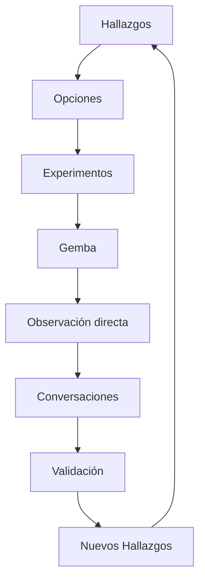

# Gemba para el Cambio

## ¿Qué es Gemba?

**Gemba** (現場) es una palabra japonesa que significa "el lugar real" o "el lugar donde ocurre el trabajo". En Lean Manufacturing, Gemba se refiere a la práctica de ir al lugar donde se realiza el trabajo para observar, entender y mejorar los procesos.

En el contexto del Lean Change Management, **Gemba para el Cambio** significa ir al lugar donde las personas trabajan y experimentan los cambios para:

1. **Observar** cómo el cambio está afectando realmente el trabajo diario.
2. **Escuchar** directamente a las personas afectadas.
3. **Entender** la brecha entre lo planificado y lo que sucede.
4. **Aprender** con base en evidencia real, no en reportes filtrados.

> "Cuando realmente quieres entender algo, ve a verlo por ti mismo. Los informes y las presentaciones siempre tienen una capa de filtrado."

Ver también: [[05-feedback-rapido]], [[07-visual-management]]

---

## ¿Por qué Gemba es importante para el cambio?

### El problema de la información filtrada

En organizaciones grandes, la información sobre el impacto de los cambios pasa por múltiples capas:

```
Realidad del trabajador
       ↓
Reporte del manager
       ↓
Resumen para director
       ↓
Informe para equipo de cambio
       ↓
Decisión basada en información incompleta
```

Cada capa agrega su interpretación, sus preocupaciones políticas y sus supuestos. El resultado es que el equipo de cambio toma decisiones con información que no refleja la realidad.

### Gemba corrige esto

Al ir al Gemba, el agente de cambio:
- **Elimina intermediarios** en la obtención de información.
- **Observa comportamientos reales**, no reportados.
- **Detecta disfunciones** que no se mencionan en reuniones formales.
- **Genera confianza** al demostrar interés genuino.

Ver también: [[03-mapa-resistencia]], [[04-entrevistas-estakeholders]]

---

## Tipos de Gemba para el Cambio

### 1. Gemba de Observación

**Propósito**: Entender cómo el cambio está afectando el trabajo diario.

**Cómo se hace**:
1. Ir al área de trabajo (física o virtual).
2. Observar sin interrumpir durante 15-30 minutos.
3. Anotar lo que ves: interacciones, flujo de trabajo, uso de herramientas, expresiones faciales.
4. Hacer preguntas abiertas después de observar.

**Preguntas útiles**:
- ¿Qué estás haciendo ahora mismo?
- ¿Cómo ha cambiado tu forma de trabajar desde que iniciamos [el cambio]?
- ¿Qué obstáculos estás encontrando?
- ¿Qué funciona bien?

**Ejemplo de La Comisión**:

> Cada mañana el VP de Ingeniería y el equipo de cambio tenían una reunión rápida frente al tablero de visualización. Se hablaba brevemente sobre los obstáculos a los que se estaba enfrentando el equipo y cómo se iban ajustando al cambio.

### 2. Gemba de Conversación

**Propósito**: Obtener feedback directo y honesto de las personas afectadas.

**Cómo se hace**:
1. Ir al lugar donde trabaja la persona.
2. Iniciar una conversación informal (no una entrevista formal).
3. Escuchar más de lo que se habla.
4. Tomar notas después de la conversación, no durante.

**Temas a explorar**:
- Cómo se siente con los cambios recientes.
- Qué ha mejorado y qué ha empeorado.
- Qué necesita para trabajar mejor.
- Qué sugeriría hacer diferente.

### 3. Gemba de Validación

**Propósito**: Verificar si un experimento está funcionando como se esperaba.

**Cómo se hace**:
1. Observar directamente el experimento en acción.
2. Hablar con los participantes sobre su experiencia.
3. Comparar lo observado con las métricas definidas.
4. Tomar una decisión informada (Perseverar, Pivotear, Abandonar).

**Ver también**: [[01-experimentos-cambio]]

---

## Cómo hacer un Gemba efectivo

### Preparación

| Paso | Descripción |
|------|-------------|
| 1. Definir el objetivo | ¿Qué quieres aprender o validar? |
| 2. Seleccionar el área | ¿Dónde está ocurriendo el cambio que quieres observar? |
| 3. Elegir el momento | ¿Cuándo es mejor observar (horas pico, reuniones, trabajo individual)? |
| 4. Preparar preguntas | Tener preguntas guía, pero no un guion rígido |

### Durante el Gemba

| Hacer | No hacer |
|-------|----------|
| Observar con atención | Interrumpir el trabajo |
| Escuchar activamente | Juzgar o criticar |
| Hacer preguntas abiertas | Hacer preguntas de sí/no |
| Mostrar curiosidad genuina | Imponer soluciones |
| Tomar notas después | Tomar notas durante (crea distancia) |

### Después del Gemba

| Paso | Descripción |
|------|-------------|
| 1. Consolidar observaciones | Escribir todo lo notado en los primeros 30 minutos |
| 2. Identificar patrones | ¿Qué se repite? ¿Qué es sorprendente? |
| 3. Conectar con Hallazgos | ¿Cómo se relaciona con los datos ya recolectados? |
| 4. Generar Opciones | ¿Qué podemos hacer con lo aprendido? |
| 5. Compartir aprendizajes | Informar al equipo de cambio |

**Ver también**: [[02-canvas-cambio]]

---

## Ejemplos de Gemba para el Cambio

### Ejemplo 1: Observar la adopción de un tablero Kanban

**Contexto**: En La Comisión, el equipo de QMO implementó tableros Kanban para visualizar el trabajo.

**Gemba**: Los coaches fueron diariamente a observar cómo los equipos usaban los tableros.

**Observaciones**:
- Algunos equipos solo actualizaban el tablero una vez por semana.
- Otros lo usaban activamente en reuniones diarias.
- Los managers no visitaban los tableros regularmente.

**Hallazgo**: La propiedad del tablero variaba significativamente entre equipos. Los equipos que se apropiaban del tablero tenían mejor coordinación.

**Acción**: En vez de imponer una práctica estándar, el equipo de cambio adaptó su enfoque para cada equipo según su nivel de madurez.

### Ejemplo 2: Validar el impacto de un cambio en el espacio de trabajo

**Contexto**: La Comisión estaba migrando a espacios de trabajo abiertos.

**Gemba**: Los coaches observaron los primeros días después de la mudanza.

**Observaciones**:
- Las personas estaban visiblemente frustradas.
- Los escritorios más pequeños no cabían los monitores dobles prometidos.
- No había un proceso claro para resolver problemas de instalaciones.

**Hallazgo**: El cambio de espacio estaba generando una disfunción organizacional que nadie estaba abordando.

**Acción**: Se implementó un [[03-mapa-resistencia|hackeo de cultura]] — un tablero de feedback anónimo para capturar las preocupaciones.

### Ejemplo 3: Entender por qué un experimento falló

**Contexto**: Se propuso comenzar todos los proyectos en rojo en vez de verde.

**Gemba**: El equipo de cambio habló directamente con directores y managers.

**Observaciones**:
- Los directores percibían el rojo como un indicador de problema, no de incertidumbre.
- Los managers temían que los patrocinadores reaccionaran negativamente.
- La cultura de control hacía inaceptable mostrar vulnerabilidad.

**Hallazgo**: El experimento chocaba con la cultura de La Comisión (Jerárquica con enfoque en control).

**Acción**: Se descartó la opción pero se generó un nuevo experimento para educar sobre la diferencia entre "rojo como problema" y "rojo como incertidumbre".

---

## Gemba en organizaciones distribuidas

Cuando el equipo de cambio no está en la misma ubicación que las personas afectadas:

### Opciones virtuales

| Método | Herramienta | Ventaja |
|--------|-------------|---------|
| Paseo virtual | Videollamada con cámara encendida | Permite ver el espacio de trabajo |
| Horas de oficina | Slot fijo para conversaciones informales | Baja presión, alta accesibilidad |
| Observación en herramientas | Revisar activity en tableros digitales | Datos objetivos de uso |
| Grabaciones de retrospectivas | Verlas después del evento | Observar dinámicas sin interferir |

### Retos del Gemba virtual

- Se pierde la observación del lenguaje corporal.
- Las conversaciones espontáneas son más difíciles.
- La confianza tarda más en construirse.

**Solución**: Combinar Gemba virtual con visitas presenciales periódicas cuando sea posible.

---

## Integración con el ciclo de Lean Change Management



El Gemba es una fuente continua de Hallazgos que alimenta todo el ciclo:
- **Antes del cambio**: Gemba para entender el estado actual.
- **Durante el cambio**: Gemba para monitorear el impacto.
- **Después del cambio**: Gemba para validar resultados y anclar en la cultura.

---

## Errores Comunes

| Error | Consecuencia | Solución |
|-------|--------------|----------|
| Ir al Gemba con soluciones predefinidas | Se ignora la realidad | Ir con preguntas, no con respuestas |
| Hacer Gemba solo al inicio del cambio | Se pierde información durante la implementación | Establecer un calendario regular |
| No actuar sobre lo observado | Pérdida de confianza | Tomar al menos una acción visible por Gemba |
| Gemba solo con managers | Se filtra la perspectiva real | Hablar directamente con colaboradores |
| Documentar pero no compartir | Los aprendizajes no se aprovechan | Compartir hallazgos con el equipo de cambio |

---

## Checklist de Gemba

- [ ] ¿Definí claramente qué quiero aprender?
- [ ] ¿Seleccioné el momento adecuado para observar?
- [ ] ¿Tengo preguntas guía preparadas?
- [ ] ¿Estoy dispuesto a escuchar sin juzgar?
- [ ] ¿Documentaré las observaciones inmediatamente después?
- [ ] ¿Compartiré los hallazgos con el equipo de cambio?
- [ ] ¿Tomaré al menos una acción basada en lo aprendido?

---

## Referencias

- Lean Enterprise Institute. *Gemba Walks*. lean.org
- Liker, J. (2004). *The Toyota Way*. McGraw-Hill.
- Little, J. (2020). *Lean Change Management 2.0*. Capítulo 4: Hallazgos.

Ver también: [[01-experimentos-cambio]], [[05-feedback-rapido]], [[07-visual-management]]
